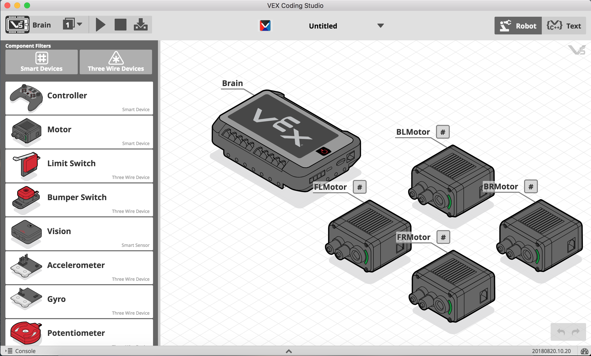
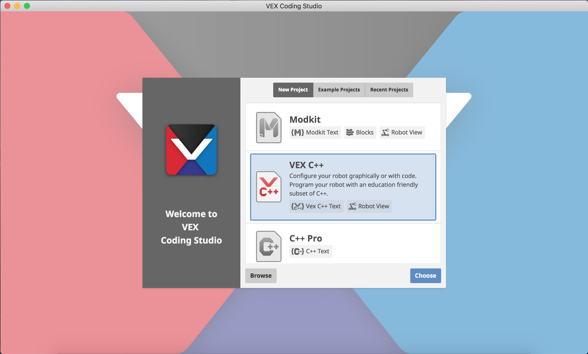

# Getting Started With VEX Coding Studio

VEX coding studio is the new development environment (editor) for V5. It's designed to be the successor to ROBOTC.

## What's New?

VCS is very similar to ROBOTC: it provides a text editor, a way of defining the ports on your robot, and a way of uploading your code. It adds a couple of nice new features I really appreciate:

**Windows and Mac Compatibility**

VCS is fully compatible with Windows and Mac - no more freaky Windows virtual environments for Mac Users!
Windows download: https://link.vex.com/downloads/vcs-pc  
Mac Download: https://link.vex.com/downloads/vcs-pc 

**Graphical Robot Setup**

You can now define all your robot's motors and sensors using a graphical interface, not just code! You can still set up your robot using code, but I'll get into that in a later section.

**Switched from C to C++**

With V5, VEX switched the main programming language from C to C++.

C++ is a very complex, powerful language, but don't be intimidated: it's just C with a couple extra concepts added on.

## Starting a Project

When you first start up VEX coding studio, you'll come to a screen like this:

