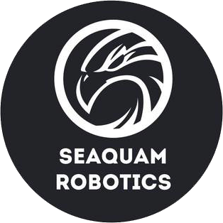

Welcome to the vex-v5-programming wiki! This will be our main source of documentation for programming our robots.

If you're switching over  from ROBOTC, take a look at this page: [Getting Started With VEX Coding Studio](Getting Started With VEX Coding Studio.md)

Programming Slack channel: https://seaquamrobotics.slack.com/messages/CCPLG0N8K/

## What is this thing?

This wiki is a collection of files managed by a piece of software called [Git](https://git-scm.com/). Git is a _version control system_ - it keeps track of different versions of files, and allows different users to collaborate on them. It's written in [markdown](https://guides.github.com/features/mastering-markdown/), a simple language for describing web pages.

You can see all the code that makes this wiki in our [Github repository](https://github.com/seaquamrobotics/vex-v5-programming). If you have a suggestion or spot a mistake, you can record it on the [issues page](https://github.com/seaquamrobotics/vex-v5-programming/issues).
